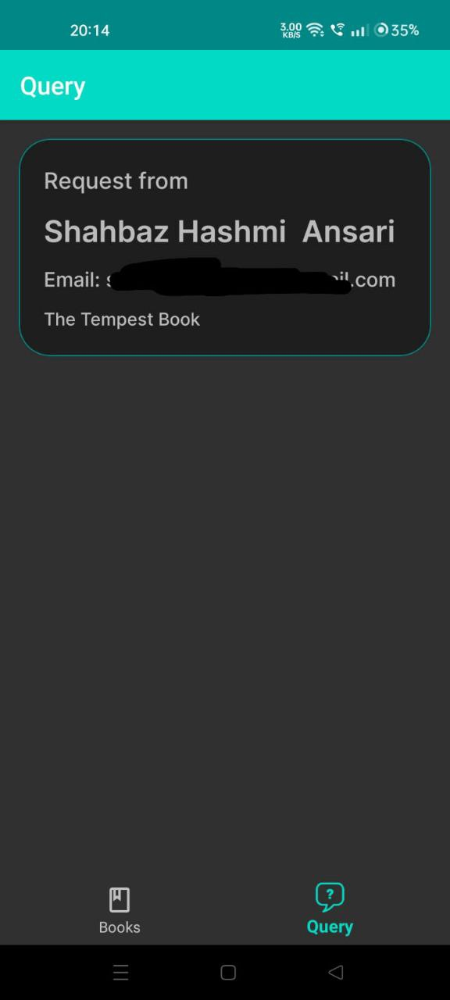

# E Pustakaalay

Welcome to E Pustakaalay, an Android Admin App for managing books and client requests seamlessly using Firebase.

## Screenshots
 

## Download APK

You can download the latest version of the E Pustakaalay Admin App from the link below:

[Download E Pustakaalay Admin App APK](https://github.com/Shams66789/E_Pustakaalay_Admin/raw/main/Apk/E-Pustakaalay.apk).

## Features

- Easily upload and manage books
- Efficiently handle client requests for books
- Seamless integration with Firebase for real-time updates
- Intuitive interface for smooth navigation
- Secure authentication for admin access

## Installation

1. Download the APK from the provided link.
2. Enable installation from unknown sources in your device settings.
3. Open the downloaded APK file and follow the on-screen instructions to install.
4. Once installed, launch the app and log in using your admin credentials.
